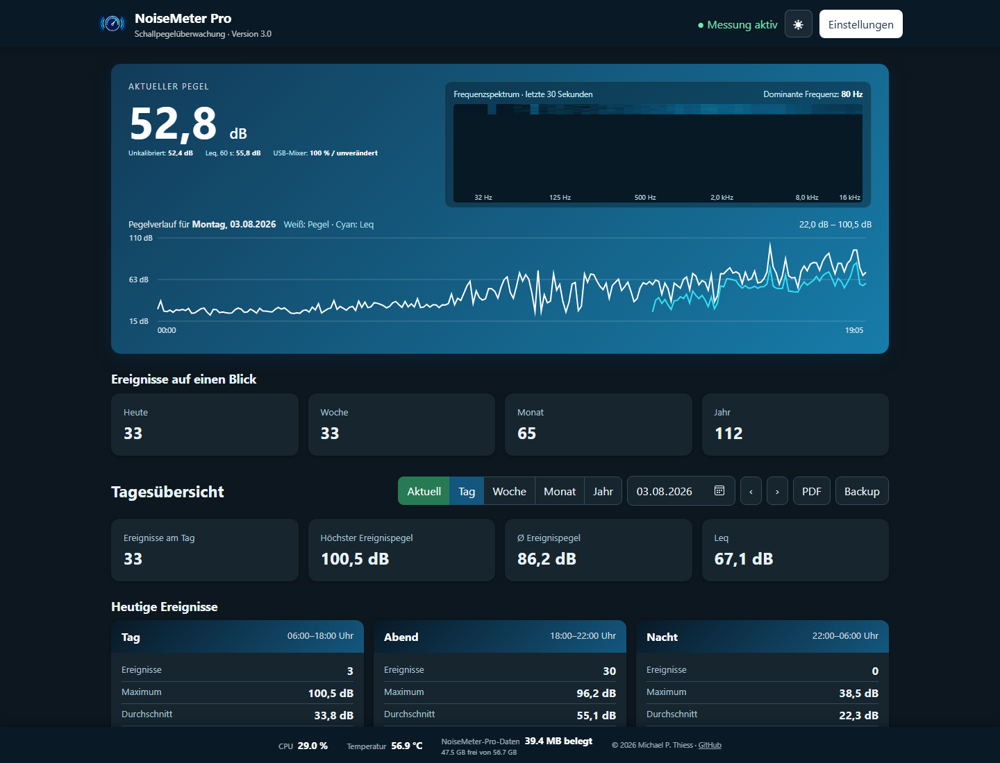

# NoiseMeter Pro 3.0

[Deutsch](README.md) | [English](README.en.md)



**Keywords:** noise measurement · sound measurement · noise log · sound level measurement · volume recording · noise event logging · Raspberry Pi · Leq · USB measurement microphone

NoiseMeter Pro is a Raspberry Pi noise-monitoring application for calibrated USB measurement microphones. It provides live A/C-weighted sound levels, Leq, a frequency-spectrum waterfall, configurable day/evening/night thresholds, MP3 event recording, long-term histories, PDF reports and XLSX/ZIP backups.

> [!IMPORTANT]
> **Required operating system: Raspberry Pi OS Bookworm (64-bit).** Do not use a newer release such as Trixie or a 32-bit image. In Raspberry Pi Imager choose **Raspberry Pi OS (other)**, then **Raspberry Pi OS (Legacy, 64-bit)**, and verify that its description explicitly mentions **Debian Bookworm**.

## Installation

1. Write **Raspberry Pi OS Bookworm Legacy (64-bit)** to a microSD card with Raspberry Pi Imager.
2. Configure hostname, user, password, Wi-Fi, time zone and Raspberry Pi Connect in Imager.
3. Boot the Pi, open its Raspberry Pi Connect remote shell and verify the operating system:

```bash
grep -E '^(PRETTY_NAME|VERSION_CODENAME)=' /etc/os-release
getconf LONG_BIT
```

The output must contain `bookworm` and `64`. Then install NoiseMeter Pro:

```bash
sudo apt update
sudo apt install -y git
git clone https://github.com/therepro21/noisemeter-pro.git
cd noisemeter-pro
sudo bash installer/install.sh
```

Open `http://<PI-IP>:8090`. Port 8090 is used to avoid conflicts with other Raspberry Pi services.

To update an existing installation:

```bash
cd ~/noisemeter-pro
git pull origin main
sudo bash installer/install.sh
```

## Calibration

The web interface accepts a ZIP bundle containing:

- one `MM2USB..._00d.sen` profile for a 0° microphone orientation,
- one `MM2USB..._90d.sen` profile for a 90° orientation,
- one PNG, JPG, JPEG, WebP or GIF calibration plot.

Both profiles and the plot remain stored. Changing the installation angle activates the corresponding profile immediately. The application attempts to set ALSA USB capture gain to 100% at startup. The active profile, capture level and calibration plot are included in PDF reports.

An example calibrated microphone is available from [HiFi-Selbstbau](https://shop.hifi-selbstbau.de/produkt/omnitronic-mm-2usb/). This is an example link; a demo calibration file was kindly provided for development and testing.

## Measurement and recording

Leq is calculated as an energy-equivalent continuous sound level, not as an arithmetic average of decibel values. It is available in the live display, histories, summaries, events, MQTT and reports.

The displayed event duration counts only samples above the configured threshold. Pre-roll and post-roll affect audio length only. A continuous threshold exceedance remains one event; its audio is streamed directly to FFmpeg and split into numbered MP3 segments of no more than five minutes to keep RAM and file sizes bounded.

Measurements for the current minute are buffered in RAM and written to SQLite in one transaction at the minute boundary to reduce microSD-card wear. MP3 audio is streamed directly to storage.

## Languages and reports

The web interface and PDF reports support English and German. English is selected on first use. The language selector next to the dark-theme button stores the user's choice in the browser and passes it automatically to PDF exports.

PDF reports include the measurement-site data, USB input level, calibration file and plot, level/Leq charts, dominant event frequencies, time-period analysis and grouped event tables. Weekly reports include a separate history chart for every day.

## MQTT / Home Assistant

MQTT is disabled by default and can be configured in the web interface. NoiseMeter Pro publishes current sound level, current Leq and daily, weekly and monthly peak values.
